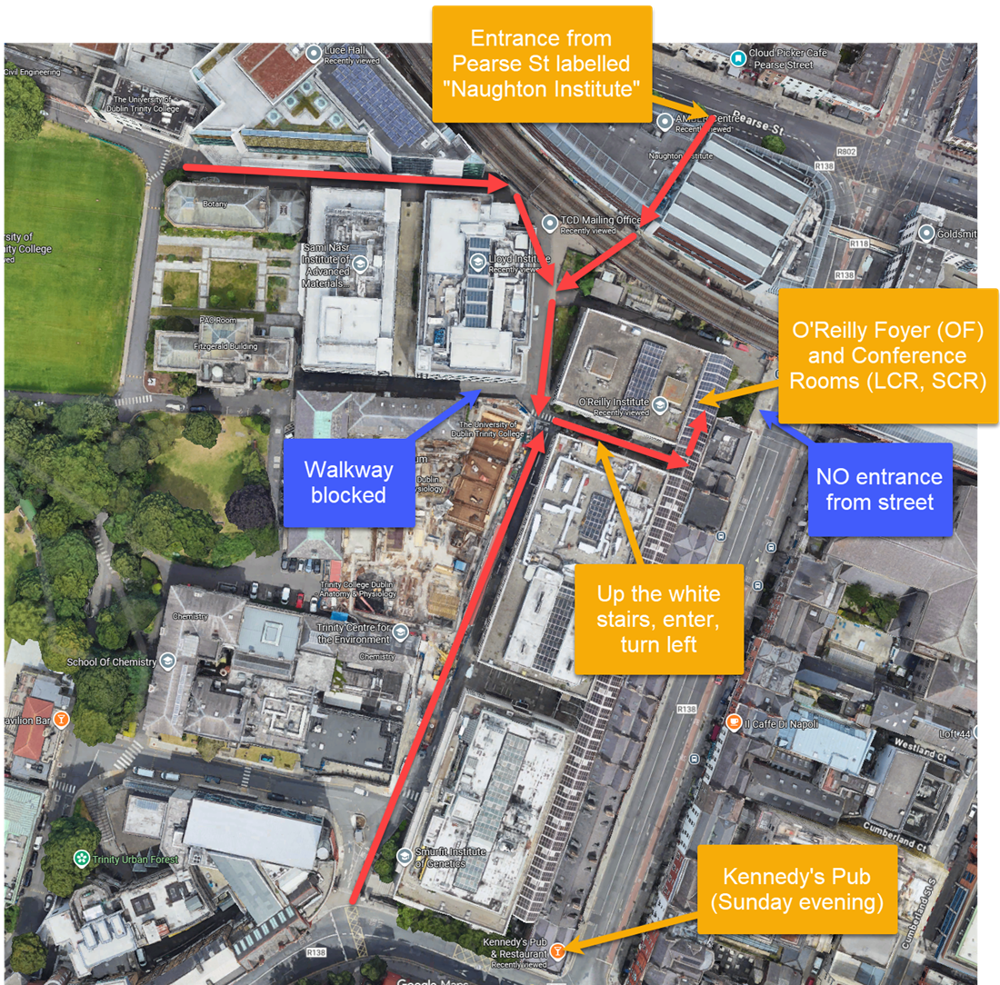

# Locations and Map

Also see the [map on Google Maps](https://www.google.com/maps/d/u/0/edit?mid=11GaV8YyppJ3vqtz9o-8gsmYEXEb-_kQ&usp=sharing).

## How to find the location

## OF
O'Reilly Foyer,
[https://maps.app.goo.gl/e2cTozieTgXK38r36](https://maps.app.goo.gl/e2cTozieTgXK38r36)

## LCR
Large Conference Room, O'Reilly Institute
[https://maps.app.goo.gl/e2cTozieTgXK38r36](https://maps.app.goo.gl/e2cTozieTgXK38r36)

## SCR 
Small Conference Room, O'Reilly Institute
[https://maps.app.goo.gl/e2cTozieTgXK38r36](https://maps.app.goo.gl/e2cTozieTgXK38r36)

## DH

Dining Hall, Trinity College Dublin
[https://maps.app.goo.gl/UR81cUVWPAHQ1irK6](https://maps.app.goo.gl/UR81cUVWPAHQ1irK6)

## Pub
Kennedy's Pub and Restaurant, 30 Westland Row, Dublin 2, D02 DP70
[https://maps.app.goo.gl/bbtbw6BV3wJ2Vrxi7](https://maps.app.goo.gl/bbtbw6BV3wJ2Vrxi7)

## Res
Restaurant (To be confirmed)
Yamamori South City
72 South Great George's Street, Dublin, D02 EC94
[https://maps.app.goo.gl/AcXAYbRkvBVMSSAn7](https://maps.app.goo.gl/AcXAYbRkvBVMSSAn7)

## TBS
Trinity Business School, 
McNabb lecture theatre
[https://maps.app.goo.gl/mryTwUUjex4wAjos6](https://maps.app.goo.gl/mryTwUUjex4wAjos6)https://maps.app.goo.gl/mryTwUUjex4wAjos6
Entrance from Campus at [https://maps.app.goo.gl/gx7EyQscPbiDwT9VA](https://maps.app.goo.gl/gx7EyQscPbiDwT9VA)
Enrtance from Pearse St at [https://maps.app.goo.gl/3qk7Gkj5Mh6AfmP27](https://maps.app.goo.gl/3qk7Gkj5Mh6AfmP27)

## Golf
Rainforest Adventure Golf, 
Unit 6, Dundrum South Dundrum Town Centre, Dundrum, Co. Dublin
[https://maps.app.goo.gl/FSFxQYdoaYPf4y7z9](https://maps.app.goo.gl/FSFxQYdoaYPf4y7z9)